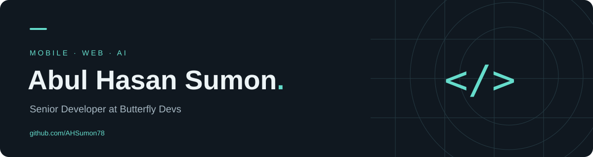

<h1 align="center">Hi there, I'm Abul Hasan Sumon 👋</h1>

<b>Building useful software. Learning through every project.</b>

## 👨‍💻 About me

- 📱 Exploring mobile application development with **Flutter and Dart**.
- 🌐 Working on web projects with **HTML, CSS, JavaScript and Python**.
- 🧠 Learning through **AI experiments, algorithms and systems projects**.
- 🛠️ I enjoy turning practical problems into opportunities to build and learn.
- 📫 Reach me at **[mmdsumonali@gmail.com](mailto:mmdsumonali@gmail.com)**.
- 🔗 Explore my work at **[ahsumon78.github.io](https://ahsumon78.github.io/)**.

 

## 🧰 Languages & tools

## 🚀 Featured repositories

| Project | About | Stack |
| --- | --- | --- |
| [Smart Campus Security](https://github.com/AHSumon78/smart_campus_security) | Face authentication, attendance, access logs and a campus web dashboard. | AI · Web |
| [Salah Master](https://github.com/AHSumon78/salah_master) | A prayer-focused Flutter application repository. | Flutter · Dart |
| [To-Do List](https://github.com/AHSumon78/To-Do-List) | To-do app screens and interface screenshots. | Flutter · Dart |
| [Face Verification](https://github.com/AHSumon78/face_verification) | Exploring face verification in Python. | Python |
| [Weather Dashboard](https://github.com/AHSumon78/dashboard) | A Python-based weather dashboard repository. | Python · Web |
| [Parallel Processing](https://github.com/AHSumon78/parallel_processing) | Exploring parallel processing concepts. | C++ |

## 📊 GitHub activity

Activity cards use an external service and may occasionally be unavailable. Explore my [repositories](https://github.com/AHSumon78?tab=repositories) directly for the latest work.

---

<b>Build. Learn. Repeat.</b> Thanks for stopping by — let's connect and create something useful.

